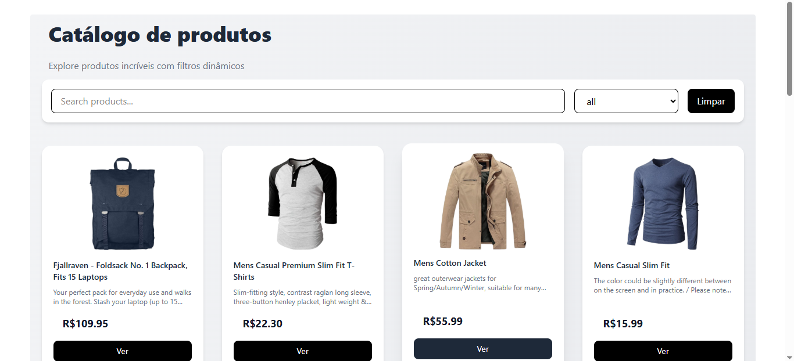
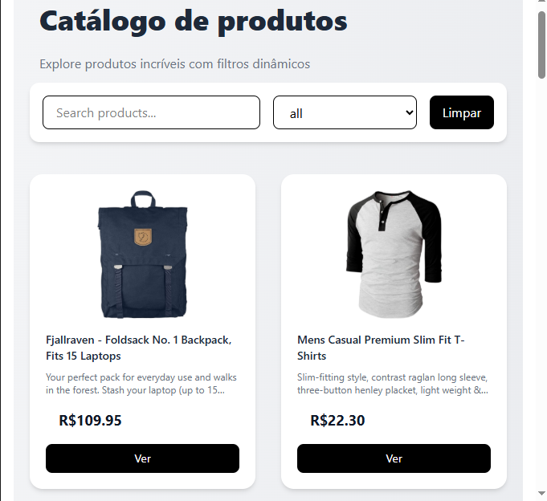

# 🛍️ React Product Catalog

Um catálogo de produtos moderno desenvolvido com React, consumindo dados de uma API externa e exibindo produtos em um layout responsivo estilo e-commerce.

---

## 🚀 Demo

🔗 [Repositório no GitHub](https://github.com/thalitasilva620/react-product-catalog)

---

## 📸 Preview





---

## 🧠 Sobre o projeto

Este projeto foi desenvolvido com o objetivo de praticar:

* Consumo de API REST
* Gerenciamento de estado com React Hooks
* Filtro e busca dinâmica de dados
* Criação de interfaces modernas com TailwindCSS
* Componentização e organização de código

Os produtos são carregados dinamicamente utilizando a Fake Store API, permitindo simular um ambiente real de e-commerce.

---

## 🛠️ Tecnologias utilizadas

* React
* TypeScript
* TailwindCSS
* Vite
* Fake Store API

---

## ✨ Funcionalidades

* 🔍 Busca de produtos por nome
* 🗂️ Filtro por categoria
* 🧾 Listagem dinâmica de produtos
* 📱 Layout responsivo
* 🎨 Interface moderna com TailwindCSS

---

## 📦 Como rodar o projeto

```bash
# Clone o repositório
git clone https://github.com/thalitasilva620/react-product-catalog

# Acesse a pasta
cd react-product-catalog

# Instale as dependências
npm install

# Rode o projeto
npm run dev
```

---

## 📁 Estrutura do projeto

```
src/
 ├── components/
 ├── hooks/
 ├── pages/
 ├── styles/
 └── App.tsx
```

---

## 🎯 Aprendizados

Durante o desenvolvimento deste projeto, aprimorei conhecimentos em:

* Manipulação de dados vindos de APIs
* Boas práticas com React
* Organização de componentes reutilizáveis
* Estilização com TailwindCSS

---

## 📌 Próximos passos

* [ ] Implementar modal de detalhes do produto
* [ ] Adicionar skeleton loading
* [ ] Criar carrinho de compras
* [ ] Melhorar acessibilidade

---

## 👩‍💻 Autora

Desenvolvido por **Thalita Silva**

🔗 [LinkedIn](https://www.linkedin.com/in/thalita-silva687)

---

## 📄 Licença

Este projeto está sob a licença MIT.

