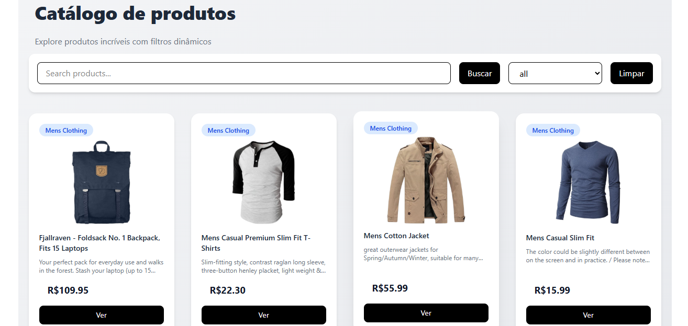

# 🛍️ React Product Catalog

Aplicação de catálogo de produtos estilo e-commerce, desenvolvida com React + TypeScript, consumindo uma API externa, com foco em experiência do usuário, performance e interface moderna

---

## 🔗 Demo

👉 Acesse o projeto online:
[Vercel](https://react-product-catalog-lm3cft2h8-thalitasilva620s-projects.vercel.app/)

---

## 📸 Preview



---

## 🧠 Sobre o projeto

Este projeto foi desenvolvido com o objetivo de praticar:

* Consumo de API REST
* Gerenciamento de estado com React Hooks
* Filtro e busca dinâmica de dados
* Criação de interfaces modernas com TailwindCSS
* Componentização e organização de código
* Experiência do usuário (UX)

Os produtos são carregados dinamicamente utilizando a Fake Store API, permitindo simular um ambiente real de e-commerce.

---

## 🛠️ Tecnologias utilizadas

* React
* TypeScript
* TailwindCSS
* Vite
* Fake Store API

---

## ✨ Funcionalidades

🔍 Busca de produtos com suporte à tecla Enter
* 🗂️ Filtro dinâmico por categoria
* 📄 Paginação de produtos
* 🧾 Listagem dinâmica via API
* 💬 Modal com detalhes do produto
* ⏳ Skeleton loading para melhor experiência
* 📱 Layout totalmente responsivo
* 🎨 Interface moderna com TailwindCSS

---

## 📦 Como rodar o projeto

```bash
# Clone o repositório
git clone https://github.com/thalitasilva620/react-product-catalog

# Acesse a pasta
cd react-product-catalog

# Instale as dependências
npm install

# Rode o projeto
npm run dev
```

---

## 📁 Estrutura do projeto

```
src/
 ├── components/
 │   ├── ProductCard.tsx
 │   ├── Products.tsx
 │   ├── Skeleton.tsx
 │   └── Modal.tsx
 │
 ├── hooks/
 │   └── useProducts.ts
 │
 ├── styles/
 │   └── index.css
 │
 ├── App.tsx
 └── main.tsx
```

---

## 🎯 Aprendizados

Durante o desenvolvimento deste projeto, aprimorei conhecimentos em:

* Manipulação de dados vindos de APIs
* Boas práticas com React
* Organização de componentes reutilizáveis
* Estilização com TailwindCSS

---

## 📌 Próximos passos

* [] Implementar debounce na busca

* []  Infinite scroll

* []  Sistema de favoritos (wishlist)

* []  Melhorias de acessibilidade (a11y)


---

## 👩‍💻 Autora

Desenvolvido por Thalita Silva
Front-end Developer em evolução 🚀

🔗 [LinkedIn](https://www.linkedin.com/in/thalita-silva687)

---

## 📄 Licença

Este projeto está sob a licença MIT.

